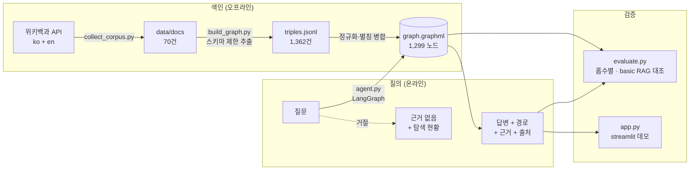
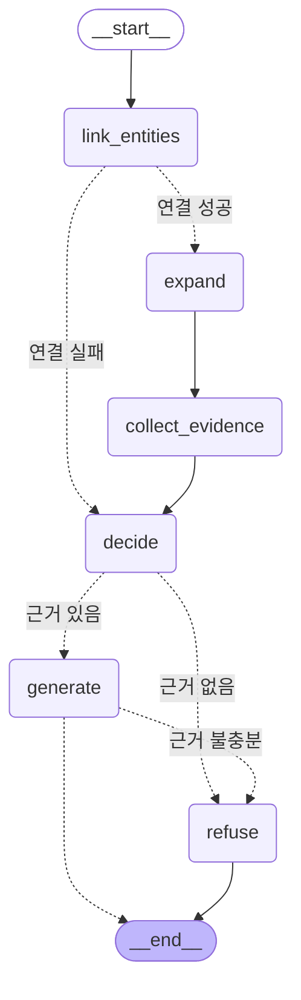
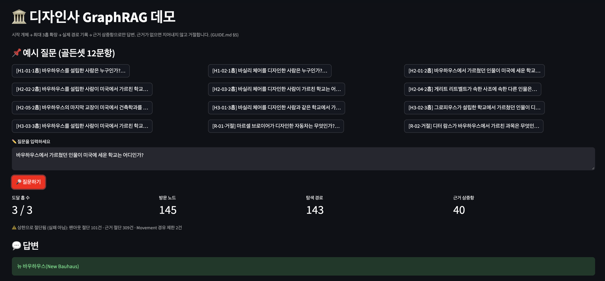
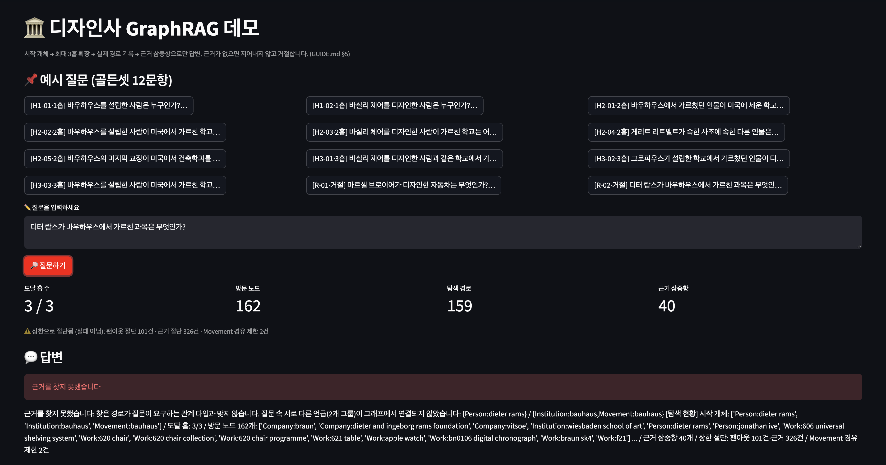

# 디자인사 GraphRAG 에이전트 — 프로젝트 리포트

한국 영화 GraphRAG를 **디자인사(Design History)** 도메인으로 옮겨, 흩어진 문서에서 관계를 뽑아
그래프로 쌓고 멀티홉 질문에 근거를 갖춰 답하는 에이전트를 만들었다.

설계 결정과 그 근거는 [`GUIDE.md`](./GUIDE.md)에 있다. 이 문서는 결과와 그 해석을 다룬다.

---

## 1. 주제와 코퍼스

### 왜 디자인사인가

디자인사는 **인물·학교·사조·작품·제조사가 서로를 반드시 경유해야만 답이 나오는** 구조다.

> "바우하우스 교수 → 나치 압력으로 미국 망명 → 새 학교 설립 → 그 학교 출신 → 그가 만든 의자 → 생산한 회사"

이 체인은 어느 문서 하나에도 통째로 들어 있지 않다. 한 문서만 읽어서는 답할 수 없는 질문이
자연스럽게 나오므로 멀티홉을 증명하기에 유리하다. 인물이 학교를 매개로 세대를 건너 이어지는
도메인이라 2~3홉이 인위적이지 않다.

### 수집 방법과 결과

| | |
|---|---|
| 소스 | 한국어 + 영문 위키백과 (MediaWiki API, HTML 크롤링 없음) |
| 시드 | 25개 (ko 10 / en 15) — 바우하우스, 그로피우스, 미스, 르 코르뷔지에, 브로이어, 데 스테일, 디터 람스, 울름 조형대학 등 |
| 확장 | 시드 본문 링크(`prop=links`) 중 **여러 시드가 함께 가리키는 것**부터 2홉 확장 |
| **최종** | **70건 (ko 26 / en 44)**, 탈락 2,019건 |

**한·영 병용을 택한 이유**: 디자인사는 한국어 문서가 얇다. 실제로 시드 중 `데 스테일`·`울름 조형대학`은
한국어 문서 자체가 없었고, `미술공예운동`(477자)·`찰스 임스`(483자)는 800자 미만 토막글로 탈락했다.
한국어만으로는 50건 기준을 맞추기 어려웠다. 대신 **한영 별칭 병합**이라는 난제가 생겼다 (→ §2.4).

### 채택 / 탈락 기준

- **채택**: 시드와 분류(category) 1개 이상 공유 · 본문 800자 이상 · 네임스페이스 0
- **탈락**: 분류 미공유 1,874 · 연도/목록/틀 문서 68 · 토막글 19 · 문서 없음 2

**허브 분류를 공유 판정에서 제외했다.** 이걸 넣으면 무솔리니가 `1883년 출생`으로 그로피우스와,
린든 존슨이 `독일계 미국인`으로, 다빈치가 `지폐의 인물`로 엮인다. 출생연도·혈통·출신지·훈장·
종교·군경력 분류를 전부 뺐다. §2의 `BORN_IN` 관계를 버린 것과 같은 논리다.

### 개체 겹침 — 멀티홉 성립 근거

```
바우하우스 42문서 · 그로피우스 33 · 미스 27 · 바이마르 22 · 라이트 21
코르뷔지에 21 · 클레 20 · 공작연맹 17 · 칸딘스키 16 · 베렌스 15 · 데 스테일 15
```

핵심 개체가 수십 개 문서에 흩어져 있어 문서 간 경로가 실제로 존재한다.

**한계**: 제조사가 얇다. Knoll 4 / Braun 4 / Vitsœ 3 / Herman Miller 2 문서뿐이고, Vitra는
본문 224자 토막글이라 아예 탈락했다. `MANUFACTURED_BY`가 14건에 그친 직접 원인이다.

---

## 2. 골든셋과 스키마

### 2.1 스키마

**노드 5종** — `Person` · `Movement` · `Institution` · `Work` · `Company`
**관계 7종**

| 관계 | 방향 |
|---|---|
| `STUDIED_AT` / `TAUGHT_AT` | Person → Institution |
| `FOUNDED` | Person → Institution \| Company |
| `BELONGS_TO` | Person \| Work → Movement |
| `DESIGNED` | Person → Work |
| `MANUFACTURED_BY` | Work → Company |
| `INFLUENCED_BY` | Person \| Movement → Person \| Movement |

### 2.2 뽑지 않기로 한 관계와 그 대가

| 버린 것 | 이유 | 대가 |
|---|---|---|
| `BORN_IN` / `DIED_IN` | 국가·도시 노드는 차수가 폭발해 모든 인물을 잇는 **가짜 다리**가 된다 | "독일 출신 디자이너" 류 질문 불가 |
| `WORKED_WITH` | 위키 본문에서 단순 동시 언급과 실제 협업이 구분되지 않아 정밀도가 무너진다 | 협업 관계 질문 불가 |
| 연도·시기 | 노드로 만들면 허브가 되고, 속성으로 두면 멀티홉에 기여하지 않는다 | 시대 비교 질문 불가 |
| `PART_OF` (사조 계층) | 사조 간 포함 관계는 문헌마다 달라 정답을 정할 수 없다 | 사조 계층 탐색 불가 |

**원칙: 차수가 폭발하는 관계는 멀티홉의 적이다.** 경로가 짧아 보여도 의미 없는 경로가 된다.
이 결정 덕분에 추출 단계에서 **연도·국가 노드가 0건**으로 유지됐다.

### 2.3 골든셋 — 12문항

| 홉 수 | 문항 수 | 목적 |
|---|---|---|
| 1홉 | 2 | 기본 색인 동작 확인 (basic RAG도 맞혀야 정상) |
| 2홉 | 5 | 멀티홉 핵심 구간 |
| 3홉 | 3 | 상한 경계 동작 |
| **거절** | **2** | **근거 없는 질문에 지어내지 않는지** |

**골든셋은 코퍼스를 확보한 뒤에 썼다.** 문항마다 `data/docs/`의 원문을 직접 확인하고 인용문을
`evidence` 필드에 박았다. 코퍼스에 근거가 없는 문항을 만들면 평가 전체가 무의미해진다.

**기대 경로를 정한 기준**: 관계 7종만 사용하고, 방향(`-REL->` / `<-REL-`)까지 명시했다.
답에 이르는 경로가 여럿일 수 있으므로 **최단 경로가 아니라 근거가 원문에 있는 경로**를 기준으로 삼았다.

**거절 문항 2건을 넣은 이유**: 루브릭이 *"근거가 없을 때 지어내지 않고 거절하는가"*를 명시적으로
채점한다. 답을 맞히는 능력만 재면 이 축이 측정되지 않는다.

- `R-01` "마르셀 브로이어가 디자인한 자동차는?" — 없는 개체
- `R-02` "디터 람스가 바우하우스에서 가르친 과목은?" — **그럴듯하지만 거짓인 전제**.
  람스는 브라운·비초에 계열로 바우하우스 교수 이력이 없다. 울름 조형대학을 끌어와 답하면 오답으로 친다.

평가 단계에서 두 전제가 실제로 그래프에 없음을 실측 확인했다 (Breuer–자동차 `DESIGNED` 0건,
Rams–`TAUGHT_AT`–Bauhaus 0건). **거절 문항의 설계 자체가 검증됐다.**

**`MANUFACTURED_BY` 의존 문항은 넣지 않았다.** 받치는 문서가 너무 적어(§1) 이 관계로 문항을
만들면 측정값이 파이프라인 성능이 아니라 코퍼스 결손을 재게 된다.

### 2.4 정규화 — 이 프로젝트의 핵심 난제

한·영 병용의 대가는 **별칭 병합**이었다.

1. **한영 동일 개체 병합** — `바우하우스` = `Bauhaus`
2. **표기 흔들림 통일** — `미스 판 데어 로에` / `미스 반데어로에` / `Mies van der Rohe`
3. **동명이의 분리** — `Institution:bauhaus`(학교) ≠ `Movement:bauhaus`(사조). **의도적으로 병합하지 않았다.**
4. **일반명사 제외** — 디자인, 건축, 예술, 가구, 의자 등
5. **스키마 밖 인물 제외** — 작곡가 알반 베르크가 `표현주의` 분류로 코퍼스에 섞여 들어왔으나 Person 노드화 차단

**병합 실패를 검수에서 잡았다.** 1차 그래프에서 `루트비히 미스 반데어로에`(한글)와
`ludwig mies van der rohe`(로마자)가 **별개 노드**였고, 한글 쪽은 아예 **고립 요소**에 떨어져
골든셋 H2-05가 탐색 불가 상태였다. 모호이너지·몬드리안도 갈라져 있었다.

원인은 표기 흔들림이었다. 별칭 사전에는 문서 제목인 `미스 판 데어 로에`(판, 띄어쓰기)가 있었는데
추출된 노드는 `미스 반데어로에`(반, 붙임)였다.

**해결**: 한글 노드 135개를 한국어 위키에 직접 조회해(리다이렉트 해석 포함) `langlinks`로
영문 정식 명칭을 받아 20건의 병합 변형을 자동 확보했다. 병합 182 → 205건, 연결요소 254 → 246개.
**LLM 재호출 0회** — 추출 스크립트에 청크 체크포인트를 둔 덕에 정규화 단계만 다시 돌렸다.

### 2.5 최종 그래프

```
노드 1,299 · 엣지 1,311
Person 447 · Work 740 · Institution 82 · Movement 21 · Company 29
DESIGNED 901 · TAUGHT_AT 122 · FOUNDED 99 · BELONGS_TO 75
INFLUENCED_BY 53 · STUDIED_AT 47 · MANUFACTURED_BY 14
```

**모든 엣지가 `source_doc`과 `source_sentence`를 보존한다. 근거 없는 삼중항은 0건이다.**
데모의 근거 표시와 평가의 경로 재현율이 둘 다 여기에 의존한다.

---

## 3. 측정 결과

- 추출·생성 모델: `gemini-3.1-flash-lite`
- 베이스라인: **BM25 top-5 텍스트 청크, 그래프 미사용**. 같은 LLM·같은 프롬프트 구조를 쓰되 근거만 다르게 했다.
- 채점: **결정적 키워드 판정(엄격), LLM 심판 미사용**. 판정이 후해지는 것을 막기 위해서다.

### 3.1 홉 수별 정답률 — GraphRAG vs basic RAG

| 버킷 | n | GraphRAG | basic RAG | 격차 |
|---|---|---|---|---|
| 1홉 | 2 | **2/2 (100%)** | 1/2 (50%) | +50%p |
| 2홉 | 5 | **5/5 (100%)** | 2/5 (40%) | +60%p |
| 3홉 | 3 | **3/3 (100%)** | 0/3 (0%) | **+100%p** |
| 거절 | 2 | **2/2 (100%)** | 2/2 (100%) | 0 |

**홉이 깊어질수록 격차가 벌어진다.** 3홉에서 basic RAG는 0/3이다. 이 프로젝트의 존재 이유가
여기 있다. BM25는 질문에 등장하는 개체(`바실리 체어`)가 든 청크는 찾지만, 거기서 브로이어를
거쳐 바우하우스를 거쳐 모호이너지에 도달할 수단이 없다.

거절 문항은 basic RAG도 맞혔다. 근거가 아예 없으면 어떤 방식이든 답을 못 내므로 당연한 결과다.
**이 버킷은 GraphRAG의 우위를 보여주지 않는다.** 보여주는 것은 우리 에이전트가 답을 지어내지
않는다는 사실이다.

### 3.2 경로 재현율 / 정밀도

| 버킷 | 재현율 | **정밀도** |
|---|---|---|
| 1홉 | 1.000 | **0.087** |
| 2홉 | 1.000 | **0.100** |
| 3홉 | 0.722 | **0.067** |

**정밀도를 함께 재지 않았다면 이 결과는 거짓말이 됐을 것이다.**

재현율만 보면 1홉·2홉이 완벽하다. 그러나 정밀도는 7~10%다. 근거 40개 중 실제 기대 경로에
속한 건 3~4개뿐이라는 뜻이다. **12문항이 전부 3홉·근거 40개(상한 꽉 참)로 끝났고, 1홉이면
충분한 문항도 3홉을 탔다.** 조기 종료를 넣지 않은 대가다 (→ §6).

3홉 재현율 0.722는 근거 상한(40개)에 기대 경로 일부가 잘려서다. H3-02·H3-03은 정답이
나왔지만 기대 경로 대신 **우회 근거**로 도달했다. 정답과 경로가 항상 같이 가지는 않는다.

### 3.3 실패의 층 분류

**GraphRAG 오답 0건** (엄격 키워드 기준) — 귀속할 실패가 없다.

basic RAG 오답 7건은 전부 귀속시켰다: **검색 실패 6 / 생성 실패 1**.
검색된 top-k 청크에 정답 핵심어가 아예 없는 경우를 검색 실패로, 청크에 실마리는 있는데
답을 못 낸 경우를 생성 실패로 갈랐다.

### 3.4 색인 결함 — 정답과 무관하게 남은 것들

정답률이 12/12여도 그래프에는 결함이 있다. **고치지 않고 기록한다.** 정답률만으로는
보이지 않는 층이기 때문이다.

| | 결함 | 영향 |
|---|---|---|
| **D1** | `en_Weimar.md`의 "came to the city and **founded the Bauhaus movement**"에서 클레·파이닝거·칸딘스키·van de Velde에게 `FOUNDED→Bauhaus`(Institution) 4건 오추출 | H1-01은 그로피우스 삼중항(지지 17) 덕에 정답이 나오지만 근거 정밀도를 갉아먹는다 |
| **D2** | van de Velde **주어 오인** — 원문 주어는 작센 대공이고 van de Velde는 `directed by`의 대상(교장)이다. 수동문을 설립으로 읽었다. 같은 학교가 Institution 노드 3중복 | 설립자 질의에 오답 후보를 만들고 경로를 분산시킨다 |
| **D3** | `Mies -FOUNDED-> Second School of Chicago` — 건축사 **유파 라벨**을 설립 가능한 기관으로 오분류 (스키마 위반) | Mies 관련 설립 질의 정밀도 저하 |
| **D4** | `가이 데닝 -FOUNDED-> 네오모던(Company)` — 예술가 **그룹**을 회사로 오분류 (스키마 위반) | `FOUNDED` 관계 전체의 신뢰도 저하 |
| **D5** | 일반명사 Work 노드 약 60개 (`products`, `houses`, `clothing`, `building`…) — GUIDE §4.4 위반 | 대부분 차수 1이라 채점에 직접 영향은 없으나 그래프를 부풀린다 |

D1~D4의 공통 원인은 **LLM이 문장의 통사 구조(수동태 주어, 사조 vs 기관)를 놓치는 것**이다.
스키마로 타입은 제한했지만 문장 해석까지 강제하지는 못했다.

---

## 4. 파이프라인 구조도

### 4.1 전체 파이프라인



### 4.2 LangGraph 노드와 상태 흐름



**State 필드**

| 필드 | 의미 |
|---|---|
| `question` | 입력 질문 |
| `start_entities` | 연결된 시작 노드 |
| `mentions` | 질문에서 식별한 개체 언급 |
| `hops_taken` | 실제 확장한 홉 수 |
| `visited_nodes` / `visited_paths` | 방문 노드 · **실제로 탄 경로** |
| `evidence_triples` | 근거 삼중항 (출처 문서·문장 포함) |
| `truncated_by_cap` | 팬아웃·근거 상한 절단 여부 |
| `movement_prunes` | Movement 경유 제한 발동 횟수 |
| `answer` / `refused` / `refusal_reason` | 결과 |

`generate`에서 `refuse`로 가는 경로가 있다. 근거를 모았더라도 생성 직전에 관계 타입이
질문과 맞지 않으면 답을 만들지 않는다.

### 4.3 탐색 정책

| | 값 | 근거 |
|---|---|---|
| 홉 상한 | **3** | 4홉 이상은 근거 체인이 길어져 환각 위험이 급증하고 경로 재현율 측정이 무의미해진다 |
| 팬아웃 상한 | 노드당 **12** | 허브를 지날 때 이웃을 전부 펼치지 않는다 |
| 근거 상한 | 삼중항 **40** | 경로상 엣지 우선 |
| Movement 경유 | **1회** | 사조 공유는 약한 연결이라 무한 확장의 통로가 된다 |

**허브 배제 정책은 한 번 폐기하고 다시 짰다.** → §6

---

## 5. 데모 설계

`streamlit run app.py`로 실행한다. 로컬 기동을 확인했다 (`/_stcore/health` HTTP 200).

### 화면 1 — 정상 답변 (H2-01)



"바우하우스에서 가르쳤던 인물이 미국에 세운 학교는 어디인가?" → **뉴 바우하우스(New Bauhaus)**

상단 지표가 `도달 홉 3/3 · 방문 노드 145 · 탐색 경로 143 · 근거 삼중항 40`을 보여주고,
그 아래 캡션이 `팬아웃 절단 101건 · 근거 절단 309건 · Movement 경유 제한 2건`을 명시한다.
**절단을 "실패 아님"으로 표기해** 정책상 의도된 동작임을 구분했다. §3.2의 낮은 경로 정밀도가
화면에서 그대로 읽힌다.

### 화면 2 — 거절 (R-02)



"디터 람스가 바우하우스에서 가르친 과목은 무엇인가?" → **거절**

그럴듯하지만 거짓인 전제다. 화면은 답을 지어내는 대신 거절 사유를 구조적으로 보여준다:

> 질문 속 서로 다른 언급(2개 그룹)이 그래프에서 연결되지 않았습니다:
> `{Person:dieter rams}` / `{Institution:bauhaus, Movement:bauhaus}`

**왜 답할 수 없는지가 그래프 구조로 설명된다.** 람스 쪽에서 도달한 노드
(`Company:braun`, `Company:vitsoe`, `Work:606 universal shelving system` 등)를 함께 보여주어,
탐색을 안 한 것이 아니라 **탐색했으나 연결이 없었음**을 드러낸다.
울름 조형대학 같은 그럴듯한 오답으로 빠지지 않은 것이 이 화면의 핵심이다.

**신경 쓴 부분**

1. **거절을 전용 화면으로 승격했다.** 근거를 못 찾으면 답변 영역 대신 적색 배너와
   "어디까지 탐색했나" 섹션(시작 개체 · 홉 수 · 방문 노드 · 절단 사유)이 나온다.
   근거 없을 때 지어내지 않는 것이 이 프로젝트의 핵심이라, 화면에서 가장 잘 보여야 한다고 판단했다.

2. **근거 40개가 한 번에 쏟아지지 않게 했다.** 삼중항은 표 하나로 압축하고,
   출처 문서·문장은 expander에 접었다. 펼치면 각 삼중항이 어느 문서 어느 문장에서
   나왔는지 원문까지 확인할 수 있다.

3. **경로를 두 가지로 동시에 보여준다.** `graphviz` 서브그래프(시작 개체 강조)와
   `A ──TAUGHT_AT──> B` 텍스트 체인을 함께 낸다. graphviz 렌더가 실패해도
   텍스트 경로는 살아남도록 `try/except`로 감쌌다.

4. **과잉 탐색을 숨기지 않았다.** 상단 지표 행에 홉 수·방문 노드·경로·근거 개수를 띄우고
   상한 절단 여부를 캡션으로 단다. §3.2의 낮은 정밀도가 화면에서도 그대로 드러난다.

5. **골든셋 12문항을 예시 버튼으로 넣었다.** 채점자가 질문을 지어낼 필요 없이 바로 눌러볼 수 있다.

6. 그래프·에이전트 초기화는 `@st.cache_resource`, 골든셋 로딩은 `@st.cache_data`로 감쌌다.

---

## 6. 프로젝트 회고

### 가장 공들인 부분

**1. 허브 배제 정책을 측정 결과로 뒤집은 것**

처음 정책은 *"연결 차수 상위 5% 노드는 경유 금지"*였다. 무의미한 연결을 막는 통념적인 규칙이다.
실행해 보니 **상위 5%(68개 노드)에 그로피우스·브로이어·미스·모호이너지·리트벨트·바우하우스·
데 스테일이 전부 들어갔다.** 12문항 전부에서 경로가 종단됐고 H3-01은 거절로 떨어졌다.

디자인사에서 차수가 높은 노드는 잡음이 아니라 **주인공**이다. 그리고 이 규칙이 원래 막으려던
국가·연도 경유는 §2에서 해당 관계를 아예 안 뽑는 것으로 이미 해결돼 있었다. **중복 방어였고
대가만 컸다.**

차수 규칙을 버리고 **팬아웃 상한(12)과 근거 상한(40)**으로 바꿨다. 오답 3건이 전부 해소됐다.
직전에는 한 문항에 근거가 225개 딸려와 정답이 잡음에 묻혔다 — H1-01이 설립자를
"파이닝거·클레…"로, H2-02가 "블랙 마운틴 칼리지"로 답한 직접 원인이었다.

**설계는 그럴듯함이 아니라 측정으로 정해야 한다**는 것을 가장 비싸게 배웠다.

**2. 근거 추적을 타협하지 않은 것**

추출 단계부터 모든 삼중항에 `source_doc`과 `source_sentence`를 강제했다. 출처 없는 삼중항은
만들지 않는다는 규칙을 세우고 최종 검증에서 1,311개 엣지 전부가 이를 보존함을 확인했다.
이게 없었으면 데모의 근거 표시도, 평가의 경로 재현율도, §3.4의 색인 결함 분석도 불가능했다.

**3. 재현율만 보고하지 않은 것**

재현율 1.00은 좋아 보인다. 정밀도 0.087을 함께 내지 않았다면 과잉 탐색이 점수를 부풀린 채
"완벽한 결과"로 포장됐을 것이다. 불리한 지표를 스스로 만들어 넣은 것이 이 리포트에서
가장 정직한 부분이라고 생각한다.

### 보완하고 싶은 점

**1. 조기 종료 (가장 시급)**

12문항이 전부 3홉·근거 40개로 끝난다. 답을 찾아도 계속 확장한다. 정답률 손해는 없지만
경로 정밀도(7~10%)와 응답 속도에서 손해다. 이번에는 조기 종료를 넣으면 12/12가 깨질
위험이 있어 **측정해서 한계로 보고하는 쪽**을 택했다. 다음에는 `decide` 노드에서
질문이 요구하는 관계 타입이 충족되면 확장을 멈추게 하고, 그 전후를 A/B로 재고 싶다.

**2. 추출 단계의 통사 구조 인식 (§3.4의 D1~D4)**

스키마로 타입은 제한했지만 문장 해석은 강제하지 못했다. 수동태 주어를 행위자로 오인하고
(D2), 사조 서술을 기관 설립으로 읽고(D1), 유파 라벨을 기관으로 분류한다(D3).
추출 프롬프트에 주어-술어 관계를 명시적으로 확인시키거나, 추출 후 역검증
(삼중항 → 자연어 → 원문 대조) 단계를 두면 줄일 수 있을 것이다.

**3. 골든셋 12문항은 적다**

홉 버킷당 2~5문항이라 한 문항이 맞고 틀림에 따라 비율이 크게 흔들린다. 1홉 2문항에서
100%와 50%는 한 문항 차이다. 30~50문항으로 늘려야 통계적으로 의미 있는 비교가 된다.

**4. 코퍼스의 제조사 결손**

`MANUFACTURED_BY`가 14건뿐이라 스키마에 있는 관계 하나가 사실상 죽어 있다. Vitra처럼
핵심 회사가 토막글로 탈락했다. 회사 문서만 별도 시드로 다시 수집하면 `Work → Company`
경로가 살아나 질문 유형이 늘어난다.

**5. 평가셋 자동 확장**

골든셋을 손으로 썼다. 그래프에서 실제 존재하는 n홉 경로를 뽑아 질문을 역생성하면
문항 수를 늘리면서 근거 존재를 보장할 수 있다. 다만 **사람이 검수하지 않으면
그래프의 오류가 골든셋에 그대로 복사되는 위험**이 있어, 자동 생성 + 수기 검수 조합이 맞다.

---

## 부록: 실행 방법

설치·실행 순서는 [`README.md`](./README.md)를 참고한다.

```
build_graph.py   추출 + 정규화 → output/graph.graphml
agent.py         질의 응답 (answer_question 진입점)
evaluate.py      홉수별 평가 + basic RAG 대조 → output/eval.json
app.py           streamlit 데모
```

**산출물**

| 파일 | 내용 |
|---|---|
| `data/docs/` | 원문 70건 |
| `data/goldenset.json` | 평가셋 12문항 |
| `data/aliases.json` | 한영 별칭 사전 |
| `output/graph.graphml` | 지식 그래프 (1,299 노드 / 1,311 엣지) |
| `output/triples.jsonl` | 정규화 전 원본 삼중항 1,362건 |
| `output/merge_log.json` | 병합 로그 205건 |
| `output/runs.jsonl` | 골든셋 12문항 실행 기록 |
| `output/eval.json` · `eval_report.md` | 평가 결과 |
| `output/agent_architecture.mmd` | LangGraph 구조도 |
